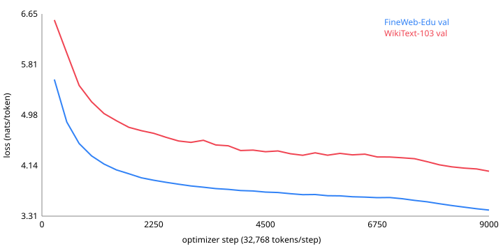

# Laptop-50M

A 49.3M-parameter language model trained **from scratch on one Apple M3 iMac** (16 GB unified memory, MPS backend) for
GIBC V2 Track 01 (TECH: ≤ 50M parameters). The model trained in the background while the machine was in daily use,
and all compute ran locally at zero cost. Everything in this README can be reproduced with the scripts in this repository.

| | |
|---|---|
| Total trainable parameters | **49,295,872**, including the token embedding and the output head (tied) — `python count_params.py` |
| Training data | 294.9M tokens of FineWeb-Edu (`sample/10BT`, shard 000). No pretrained weights, no fine-tuning, no distillation |
| Hardware | iMac (Mac15,5), Apple M3 (8-core CPU, 10-core GPU), 16 GB, macOS 26.5.1, PyTorch 2.8.0 MPS, bf16 autocast |
| Training time | **39.6 h wall-clock** (process time incl. pausing for the user), **≈ 20.5 h at full speed** (294.9M tok / 3,995 tok/s median) |
| Compute | 6·N·D = 6 × 49.3M × 294.9M ≈ **8.7 × 10¹⁶ FLOPs** (non-embedding N: 7.2 × 10¹⁶) |
| Peak memory | ≈ 4.7 GB (batch 4 × 512, bf16) |

## Results (0-shot, lm-evaluation-harness 0.4.13, full evaluation sets)

| Task | Metric | Laptop-50M | ± stderr | Random chance |
|---|---|---|---|---|
| HellaSwag (val, 10,042) | acc / acc_norm | 26.51 / **27.30** | 0.44 / 0.44 | 25.0 |
| ARC-Easy (test, 2,376) | acc / acc_norm | **39.48** / 36.03 | 1.00 / 0.99 | 25.0 |
| PIQA (val, 1,838) | acc / acc_norm | **56.75** / 55.60 | 1.16 / 1.16 | 50.0 |
| WinoGrande (val, 1,267) | acc | **50.67** | 1.41 | 50.0 |
| WikiText-103 test (lm-eval, 62 docs) | word perplexity | **105.03** | — | — |
| | byte perplexity / bits per byte | 2.388 / 1.256 | — | — |
| WikiText-103 test, token-level (316,293 tokens) | perplexity per token (window 512, stride 256) | **46.05** | — | — |
| WikiText-103 validation, token-level (276,394 tokens) | perplexity per token (window 512, stride 256) | 48.76 | — | — |

Raw output: [`results/eval_l50m-v1.json`](results/eval_l50m-v1.json) (evaluation wall-clock: 535 s on the same M3 GPU).

Notes on the metrics:
- **WikiText-103 perplexity is out-of-domain.** No WikiText text was used for training. The lm-eval `wikitext103` task in
  [`eval_tasks/`](eval_tasks/wikitext103) is lm-eval's built-in `wikitext` task (same detokenizer and metrics) pointed at
  the `wikitext-103-raw-v1` config. WikiText-2 and WikiText-103 share the same test articles.
- **Word and byte perplexity do not depend on the tokenizer**, so they are the numbers to compare across models.
  Per-token perplexity depends on the 16k BPE vocabulary. The value logged during training (57.44) was measured on 25
  random 512-token windows with no left context. The table uses a sliding window, so every token has up to 512 tokens of context.



Validation loss (FineWeb-Edu held-out: last 4 row groups, 4.57M tokens) was measured 36 times. It went up only twice, by at most 0.003 (at steps 5,500 and 7,000): 5.566 (step 250) → 3.725 (4,250) → 3.459 (8,500) → **3.410 (9,000)**.
The drop over the last 20% comes from the linear LR decay (WSD schedule).

## Design: spend the 50M budget on depth, not on the vocabulary

The rule counts the embedding and output head. At d=512, a GPT-2 vocabulary (50,257) with an untied head would use
51.5M parameters on its own, which is over the whole budget. Laptop-50M uses two choices:

1. **Tied input/output embedding.** The head reuses the embedding matrix, so it is counted once.
2. **16,384-token byte-level BPE** trained on the same data. Embedding = 8.4M (17% of the budget), and the other
   40.9M (83%) goes to 12 transformer blocks.

| Component | Parameters |
|---|---|
| Token embedding = output head (tied), 16,384 × 512 | 8,388,608 |
| 12 × block (attention 4d² + SwiGLU 3·d·1536 + 2 RMSNorm) | 40,906,752 |
| Final RMSNorm | 512 |
| **Total** | **49,295,872** |

Architecture: decoder-only, pre-norm RMSNorm, RoPE (θ = 10,000), SwiGLU (hidden 1,536), 8 heads, no biases,
context 512. [`configs/l50m-v1.json`](configs/l50m-v1.json) holds the exact config. `count_params.py` instantiates the PyTorch module and counts
`requires_grad` parameters (tied weights once). A unit test checks that the count matches the closed-form formula.

```
$ python count_params.py --config configs/l50m-v1.json
token embedding (tied with output head): 8,388,608
transformer blocks + final norm: 40,907,264
TOTAL trainable parameters: 49,295,872 <= 50,000,000: True
```

## Training setup

| | |
|---|---|
| Tokens | 9,000 steps × 32,768 tokens (batch 4 × 512 × grad-accum 16) = 294,912,000 |
| Optimizer | AdamW β = (0.9, 0.95), weight decay 0.1 (matrices only), grad clip 1.0 |
| LR schedule | WSD: 300 warmup → 1e-3 constant → linear decay to 1e-4 over the last 20% |
| Precision | bf16 autocast on MPS (fp32 master weights) |
| Checkpointing | every 15 min + on SIGTERM; resumable with the optimizer state (one resume after a reboot at step 8,961) |
| Data | FineWeb-Edu `sample/10BT/000_00000.parquet` (ODC-By 1.0): the first 400 row groups (443.9M tokens) for training, the last 4 for validation; tokenizer trained on the first 60 row groups |

**Laptop-friendly training.** The training loop ran on a machine that was in use during the day:
- Heavy stages start only after the user has been idle for ≥ 120 s (`infrastructure/idle_gate.py`, reads `HIDIdleTime`).
- While the user is active, a duty-cycle pacer sleeps 3× the step time after each step (≈ 25% GPU duty) and
  releases the MPS cache (`infrastructure/pacer.py`). When the user is idle, training runs at full speed (≈ 4,000 tok/s).
- Everything runs under `nice 20`. This is why the wall-clock (39.6 h) is about twice the full-speed compute time (≈ 20.5 h).
- An earlier try with fp32 and batch 8 × 1024 used 14.3 GB and swapped (101–211 tok/s), so it was rejected in favour of bf16 at 4 × 512 (≈ 3,000–4,000 tok/s, 4.7 GB).

## Reproduce

```sh
python3.11 -m venv .venv && .venv/bin/pip install -r requirements.txt
./download_data.sh                      # FineWeb-Edu shard 000 (2.15 GB) + WikiText-103 val/test
.venv/bin/python -m pytest -q           # 23 tests
./run_pipeline.sh                       # tokenizer + tokenization + training -> runs/l50m-v1/ckpt.pt
.venv/bin/python count_params.py --config configs/l50m-v1.json
.venv/bin/python -m laptop50m.infrastructure.eval_cli --ckpt runs/l50m-v1/ckpt.pt --out results
.venv/bin/python -m laptop50m.infrastructure.plot_curve runs/l50m-v1/train_log.jsonl results/loss_curve.svg
```

`eval_cli` runs lm-evaluation-harness through a custom `TemplateLM` adapter
([`laptop50m/adapters/lm_eval_adapter.py`](laptop50m/adapters/lm_eval_adapter.py)) with `num_fewshot=0` on
`hellaswag`, `arc_easy`, `piqa`, `winogrande` and `wikitext103`, then adds token-level sliding-window perplexity.
Log-likelihoods come from one causal forward pass per batch, and continuations are scored with right padding. Tests check
that the scores match a manual computation and do not change with batch size (`tests/test_eval.py`).
The trained checkpoint (`runs/l50m-v1/ckpt.pt`, 592 MB with optimizer state) is not tracked by git.

## Repository layout (clean architecture)

```
laptop50m/domain/          config + parameter budget, LR schedule (pure Python, no torch)
laptop50m/application/     training loop, sliding-window perplexity (ports injected)
laptop50m/adapters/        PyTorch model, memmap token shards, lm-eval adapter
laptop50m/infrastructure/  CLIs: prepare_data, train_cli, eval_cli, plot_curve, idle gate, pacer
eval_tasks/                lm-eval task config for WikiText-103
tests/                     acceptance tests AC-1 … AC-15 (see SPEC.md)
```

## AI tool use (disclosure)

AI coding assistants are allowed in this hackathon, and we disclose our use in full:
- **Claude Code (Anthropic Claude)** wrote this project as an AI agent working under the entrant's direction.
  It wrote the spec (`SPEC.md`), the tests, all source code, the data pipeline, and the training and evaluation runs, and it drafted this README.
  The entrant set the goal and the constraints (one laptop, zero cost, ≤ 50M parameters) and owns the submission.
- **No AI model is part of the trained model.** No pretrained weights, no fine-tuning, no distillation, and no
  AI-generated training data. The weights were initialised randomly and trained only on FineWeb-Edu text.
  The tokenizer was trained from scratch on the same data.
- All numbers in this README are copied from script output (`results/eval_l50m-v1.json`, `runs/l50m-v1/train_log.jsonl`,
  `count_params.py`).

## Licenses

Code: MIT. Data: FineWeb-Edu (ODC-By 1.0), WikiText-103 (CC BY-SA 3.0, evaluation only).
Evaluation: EleutherAI lm-evaluation-harness (MIT).
